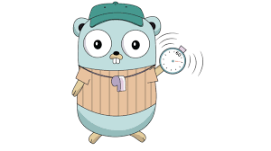

<!-- Improved compatibility of back to top link: See: https://github.com/catalystsquad/go-scheduler/pull/73 -->
<a name="readme-top"></a>
<!--
*** Thanks for checking out the Best-README-Template. If you have a suggestion
*** that would make this better, please fork the repo and create a pull request
*** or simply open an issue with the tag "enhancement".
*** Don't forget to give the project a star!
*** Thanks again! Now go create something AMAZING! :D
-->


<!-- PROJECT SHIELDS -->
<!--
*** I'm using markdown "reference style" links for readability.
*** Reference links are enclosed in brackets [ ] instead of parentheses ( ).
*** See the bottom of this document for the declaration of the reference variables
*** for contributors-url, forks-url, etc. This is an optional, concise syntax you may use.
*** https://www.markdownguide.org/basic-syntax/#reference-style-links
-->
[![Contributors][contributors-shield]][contributors-url]
[![Forks][forks-shield]][forks-url]
[![Stargazers][stars-shield]][stars-url]
[![Issues][issues-shield]][issues-url]
[![Apache 2.0 License][license-shield]][license-url]

<!-- PROJECT LOGO -->
<br />
<div align="center">
  <a href="https://github.com/catalystsquad/go-scheduler">
    
  </a>

<h3 align="center">go-scheduler</h3>

  <p align="center">
    A go task scheduler / runner library with various backends and triggers
    <br />
    <a href="https://github.com/catalystsquad/go-scheduler"><strong>Explore the docs »</strong></a>
    <br />
    <br />
    <a href="https://github.com/catalystsquad/go-scheduler/issues">Report Bug</a>
    ·
    <a href="https://github.com/catalystsquad/go-scheduler/issues">Request Feature</a>
  </p>
</div>


<!-- TABLE OF CONTENTS -->
<details>
  <summary>Table of Contents</summary>
  <ol>
    <li>
      <a href="#about-the-project">About The Project</a>
      <ul>
        <li><a href="#built-with">Built With</a></li>
      </ul>
    </li>
    <li>
      <a href="#getting-started">Getting Started</a>
      <ul>
        <li><a href="#prerequisites">Prerequisites</a></li>
        <li><a href="#installation">Installation</a></li>
      </ul>
    </li>
    <li><a href="#roadmap">Roadmap</a></li>
    <li><a href="#contributing">Contributing</a></li>
    <li><a href="#license">License</a></li>
  </ol>
</details>


<!-- ABOUT THE PROJECT -->
## About The Project

[//]: # ([![Product Name Screen Shot][product-screenshot]]&#40;https://example.com&#41;)

There are a handful of golang task schedulers but none of them suited our needs so we created one. Our initial need was for reminders (texts/emails/sms) with various triggers like cron, execute once, or natural language such as "every other tuesday"

Reasons we rolled our own scheduler:
* We wanted a trigger interface so that new triggers can easily be created
* We wanted a storage interface so that the scheduler can be run in different modes for different scales

Distinct Features:
* Trigger interface (this isn't unique to this project)
* Support for any storage backend you want to create
* Horizontal scalability
* Configurable execution window to control resource usage

Implemented Backends:
* Memory - An in-memory b-tree, useful for toys/testing

Planned Backends:
* Cockroachdb - To allow horizontal scalability, useful for real-world production scenarios

Implemented Triggers:
* ExecuteOnce - Executes once at the specified time, respects retries and expiration

Planned Triggers:
* CRON - Execute on a cron schedule
* Natural language - Execute every other tuesday at 9:34am

FAQ:
* What do you mean by "execution window"
  * stuff
* What does the `ExpireAfter` field on a task do?
  * stuff

<p align="right">(<a href="#readme-top">back to top</a>)</p>


### Built With

[![Go][Go-badge]][go-url]

<p align="right">(<a href="#readme-top">back to top</a>)</p>


<!-- GETTING STARTED -->
## Getting Started

This example uses the memory store, you can use any store that exists or PR your own.
```go
// instantiate a store
store := pkg.NewMemoryStore()
// define a handler function
handler := func(task pkg.Task) error {
  fmt.Println("handling a task")
  return nil
}
// instantiate a scheduler instance, defining the window to get scheduled tasks
scheduler, err := pkg.NewScheduler(1*time.Second, handler, store)
// start the scheduler in a goroutine
go scheduler.Run()
// define a task
id := uuid.New()
metaData := map[string]string{"some metadata": "about the task, this can be whatever you want"}
executeAt := time.Now().Add(5 * time.Second)
expireAfter := 10 * time.Second
task := pkg.Task{
  Id:                 &id,
  Metadata:           metaData,
  RetryOnError: true,
  ExpireAfter: &expireAfter,
  ExecuteOnceTrigger: pkg.NewExecuteOnceTrigger(executeAt),
}
// schedule the task
err := scheduler.ScheduleTask(task)
// your handler will now be called at the time specified in the trigger, and the task you defined will be pased to your handler
```

### Prerequisites

There are no prerequisites, it's an importable go library. If you're using a backend that requires a database, you have to deploy that database somewhere.

### Installation

`go get github.com/catalystsquad/go-scheduler`

<p align="right">(<a href="#readme-top">back to top</a>)</p>

<!-- ROADMAP -->
## Roadmap

- [ ] Add CRON trigger
- [ ] Add Cockroachdb backend support
- [ ] Add Natural language trigger

See the [open issues](https://github.com/catalystsquad/go-scheduler/issues) for a full list of proposed features (and known issues).

<p align="right">(<a href="#readme-top">back to top</a>)</p>


<!-- CONTRIBUTING -->
## Contributing

1. Fork the Project
2. Create your Feature Branch (`git checkout -b feature/AmazingFeature`)
3. Commit your Changes (`git commit -m 'Add some AmazingFeature'`)
4. Push to the Branch (`git push origin feature/AmazingFeature`)
5. Open a Pull Request

<p align="right">(<a href="#readme-top">back to top</a>)</p>


<!-- LICENSE -->
## License

Distributed under the APACHE 2.0 License. See `LICENSE.txt` for more information.

<p align="right">(<a href="#readme-top">back to top</a>)</p>


<!-- MARKDOWN LINKS & IMAGES -->
<!-- https://www.markdownguide.org/basic-syntax/#reference-style-links -->
[contributors-shield]: https://img.shields.io/github/contributors/catalystsquad/go-scheduler.svg?style=for-the-badge
[contributors-url]: https://github.com/catalystsquad/go-scheduler/graphs/contributors
[forks-shield]: https://img.shields.io/github/forks/catalystsquad/go-scheduler.svg?style=for-the-badge
[forks-url]: https://github.com/catalystsquad/go-scheduler/network/members
[stars-shield]: https://img.shields.io/github/stars/catalystsquad/go-scheduler.svg?style=for-the-badge
[stars-url]: https://github.com/catalystsquad/go-scheduler/stargazers
[issues-shield]: https://img.shields.io/github/issues/catalystsquad/go-scheduler.svg?style=for-the-badge
[issues-url]: https://github.com/catalystsquad/go-scheduler/issues
[license-shield]: https://img.shields.io/github/license/catalystsquad/go-scheduler.svg?style=for-the-badge
[license-url]: https://github.com/catalystsquad/go-scheduler/blob/master/LICENSE.txt
[linkedin-shield]: https://img.shields.io/badge/-LinkedIn-black.svg?style=for-the-badge&logo=linkedin&colorB=555
[linkedin-url]: https://linkedin.com/in/othneildrew
[product-screenshot]: images/screenshot.png
[Go-badge]: https://img.shields.io/badge/go-%2300ADD8.svg?style=for-the-badge&logo=go&logoColor=white
[Go-url]: https://go.dev/
[Next.js]: https://img.shields.io/badge/next.js-000000?style=for-the-badge&logo=nextdotjs&logoColor=white
[Next-url]: https://nextjs.org/
[React.js]: https://img.shields.io/badge/React-20232A?style=for-the-badge&logo=react&logoColor=61DAFB
[React-url]: https://reactjs.org/
[Vue.js]: https://img.shields.io/badge/Vue.js-35495E?style=for-the-badge&logo=vuedotjs&logoColor=4FC08D
[Vue-url]: https://vuejs.org/
[Angular.io]: https://img.shields.io/badge/Angular-DD0031?style=for-the-badge&logo=angular&logoColor=white
[Angular-url]: https://angular.io/
[Svelte.dev]: https://img.shields.io/badge/Svelte-4A4A55?style=for-the-badge&logo=svelte&logoColor=FF3E00
[Svelte-url]: https://svelte.dev/
[Laravel.com]: https://img.shields.io/badge/Laravel-FF2D20?style=for-the-badge&logo=laravel&logoColor=white
[Laravel-url]: https://laravel.com
[Bootstrap.com]: https://img.shields.io/badge/Bootstrap-563D7C?style=for-the-badge&logo=bootstrap&logoColor=white
[Bootstrap-url]: https://getbootstrap.com
[JQuery.com]: https://img.shields.io/badge/jQuery-0769AD?style=for-the-badge&logo=jquery&logoColor=white
[JQuery-url]: https://jquery.com 
